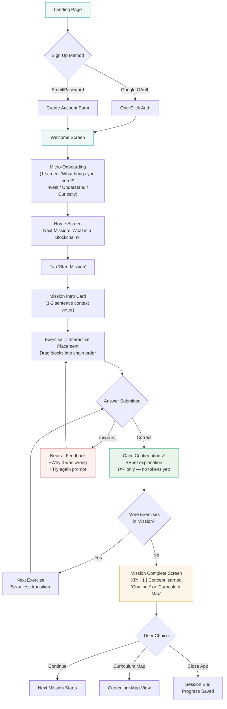
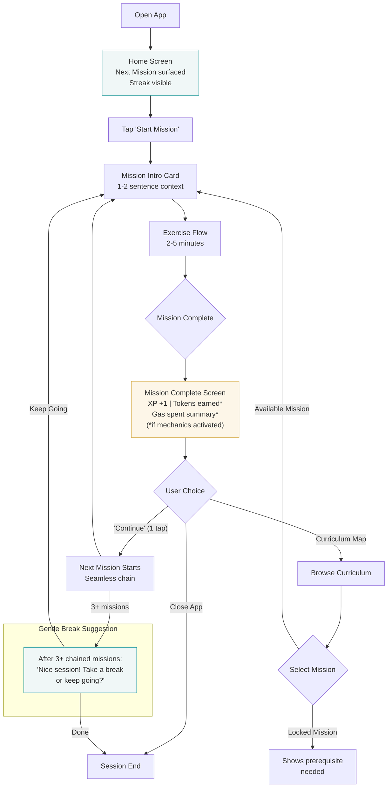
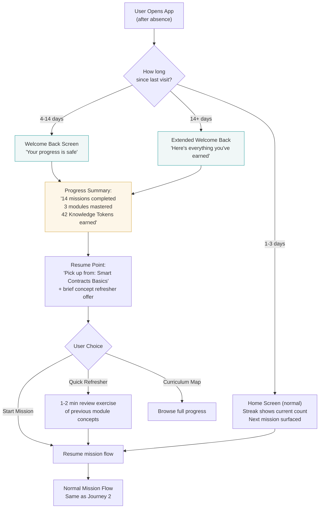
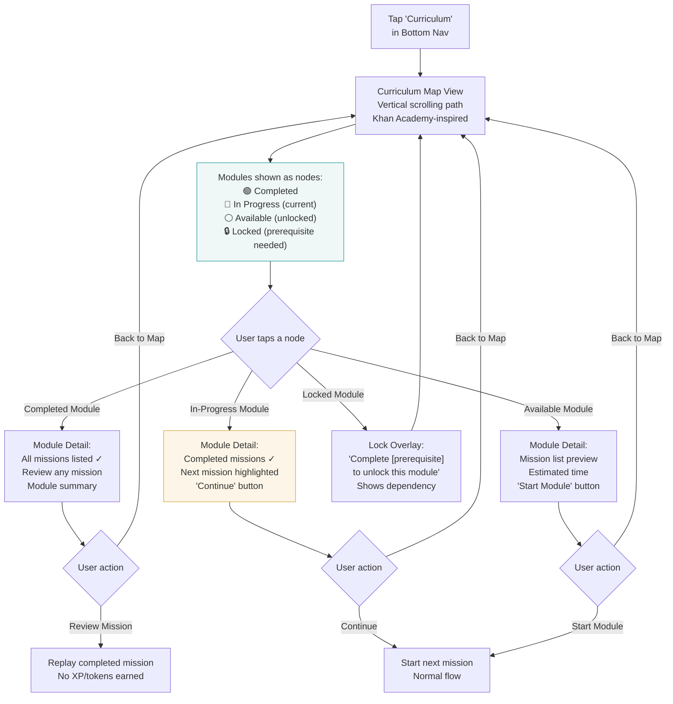

# User Journey Flows — transcendence

## Journey 1: First-Time User (Onboarding → First Mission)

---

## Journey 2: Daily Session (Return → Mission → Chain)

---

## Journey 3: Progressive Mechanic Reveal (XP → Tokens → Gas → Wallet)

```mermaid
flowchart TD
    subgraph "Phase 1: XP Only (Early Missions)"
        A1[Complete Mission] --> A2["Mission Complete:<br/>XP +1<br/>Simple, clean, no clutter"]
        A2 --> A3["Home Screen:<br/>XP counter visible<br/>No token balance shown"]
    end

    subgraph "Phase 2: Tokens Introduced (Curriculum teaches tokens)"
        B0["Curriculum Milestone:<br/>'What are crypto tokens?'<br/>mission completed"] --> B1["✨ Reveal Moment ✨<br/>'You've been earning<br/>Knowledge Tokens!'"]
        B1 --> B2["Token balance appears<br/>on Home + Mission Complete<br/>Retroactive count shown"]
        B2 --> B3["Brief explanation:<br/>'Tokens are digital assets.<br/>You now own some.'"]
    end

    subgraph "Phase 3: Gas Fees Activated (Curriculum teaches gas)"
        C0["Curriculum Milestone:<br/>'What are gas fees?'<br/>mission completed"] --> C1["✨ Reveal Moment ✨<br/>'Every action on a blockchain<br/>costs gas — even yours.'"]
        C1 --> C2["Gas indicator appears<br/>on exercise submissions<br/>Each submit costs tokens"]
        C2 --> C3["User experiences gas:<br/>correct = 1 gas cost<br/>incorrect = 1 gas cost + resubmit"]
    end

    subgraph "Phase 4: Wallet-Profile (Curriculum teaches wallets)"
        D0["Curriculum Milestone:<br/>'What is a crypto wallet?'<br/>mission completed"] --> D1["✨ Reveal Moment ✨<br/>'Your profile has been<br/>a wallet all along.'"]
        D1 --> D2["Profile transforms:<br/>Token balance (large, centered)<br/>Transaction history<br/>Learning portfolio"]
        D2 --> D3["User realizes:<br/>XP = activity history<br/>Tokens = wallet balance<br/>Gas = transaction costs"]
    end

    A3 --> B0
    B3 --> C0
    C3 --> D0

    style B1 fill:#fdf6e8,stroke:#D4A843
    style C1 fill:#fdf6e8,stroke:#D4A843
    style D1 fill:#fdf6e8,stroke:#D4A843
```

---

## Journey 4: Drop-off & Return

---

## Journey 5: Curriculum Navigation

