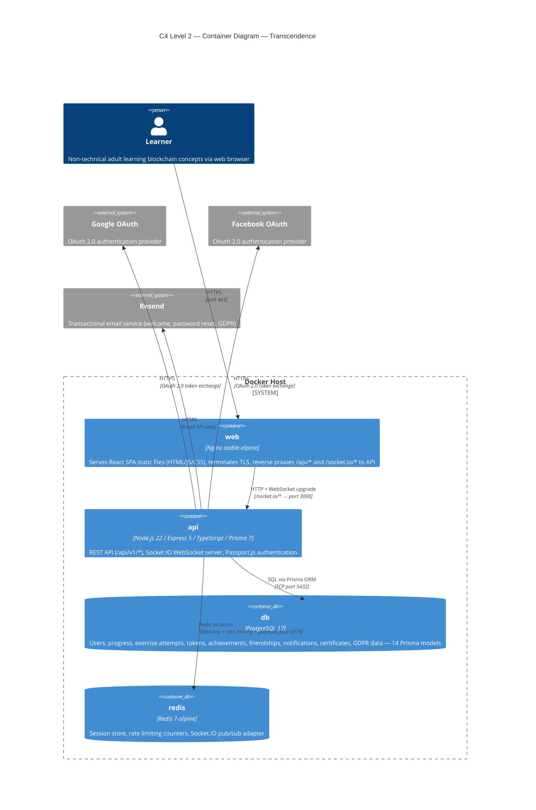

# Revision Backend — Transcendence

Document de revision pour l'evaluation. Chaque section couvre un concept cle de l'architecture backend.

---

## 1. API REST

**API** = Application Programming Interface. C'est un contrat qui definit comment deux programmes communiquent entre eux.

**REST** = un style d'architecture pour les API web. Ses principes :

1. **Des ressources identifiees par des URLs** — chaque "chose" a une adresse :
   - `/api/v1/users` = les utilisateurs
   - `/api/v1/curriculum/missions` = les missions

2. **Des verbes HTTP pour les actions** :
   - `GET` = lire
   - `POST` = creer
   - `PUT/PATCH` = modifier
   - `DELETE` = supprimer

3. **Stateless** — chaque requete contient toutes les infos necessaires. Le serveur ne "se souvient" pas des requetes precedentes.

4. **Reponses en JSON** — le serveur renvoie des donnees structurees. REST ne force pas JSON en theorie, mais en pratique c'est quasiment toujours du JSON.

**Exemple concret dans le projet :**

```
GET /api/v1/users/me  →  { "data": { "email": "...", "displayName": "...", "xp": 42 } }
```

Le frontend React envoie une requete HTTP, le backend Express recoit la requete via la route definie dans `apps/api/src/routes/users.ts`, le service recupere les donnees via Prisma, et renvoie du JSON.

REST s'oppose a d'autres styles comme GraphQL (une seule URL, le client decrit ce qu'il veut) ou les WebSockets (connexion persistante bidirectionnelle — ce qu'on utilise avec Socket.IO pour le temps reel).

---

## 2. Node.js et Express

### Node.js

Node.js c'est l'**environnement qui permet d'executer du JavaScript en dehors du navigateur**.

A la base, JavaScript ne tourne que dans un navigateur (Chrome, Firefox, etc.). Node.js prend le moteur JavaScript de Chrome (V8) et le rend utilisable sur un serveur ou une machine locale. Grace a ca, on peut ecrire du backend en JavaScript (ou TypeScript dans notre cas).

Concretement, quand le conteneur Docker `api` demarre, il execute :
```
node dist/index.js
```

C'est Node.js qui fait tourner le serveur Express. Sans Node.js, Express n'existe pas — c'est juste une librairie JavaScript qui a besoin de Node.js pour s'executer.

**L'interet pour notre projet :** le frontend (React) et le backend (Express) sont tous les deux en TypeScript/JavaScript. Un seul langage pour toute la stack, et on peut partager du code entre les deux via `packages/shared` (les schemas Zod par exemple).

### Express

Express est un **framework web pour Node.js**. C'est la couche qui recoit les requetes HTTP et les envoie vers le bon code.

Sans Express, il faudrait gerer soi-meme le parsing des URLs, des headers, du body, des cookies, etc. Express fait tout ca et fournit une API simple :

```typescript
app.get("/api/v1/users/me", (req, res) => {
  // req = la requete entrante (headers, body, cookies, params...)
  // res = l'objet pour construire la reponse
  res.json({ data: user });
});
```

Son autre concept cle c'est les **middlewares** (voir section suivante).

Express est a Node.js ce que Rails est a Ruby ou Django a Python — le framework standard pour construire des API web.

---

## 3. Middlewares

Un **middleware** c'est une fonction qui s'intercale entre la requete entrante et la route. Elle recoit `req`, `res`, et `next` — elle fait son traitement, puis soit elle appelle `next()` pour passer au suivant, soit elle renvoie une reponse (erreur, redirection, etc.) et la chaine s'arrete.

C'est comme des checkpoints de securite a l'aeroport : controle des billets, puis detecteur de metaux, puis controle des passeports — si tu echoues a un checkpoint, tu n'accedes pas a l'avion.

### Middlewares custom du projet

Situes dans `apps/api/src/middleware/` :

| Middleware | Fichier | Role |
|-----------|---------|------|
| **auth** | `auth.ts` | Verifie que l'utilisateur est connecte (session valide). Si non → 401 Unauthorized. Utilise sur toutes les routes protegees. |
| **validate** | `validate.ts` | Valide le body/params/query de la requete avec un schema Zod. Si les donnees sont invalides → 400 Bad Request avec les erreurs par champ. |
| **rateLimiter** | `rateLimiter.ts` | Limite le nombre de requetes par IP sur un intervalle (ex : 3 tentatives de 2FA par 15 min). Si depasse → 429 Too Many Requests. |
| **errorHandler** | `errorHandler.ts` | Le "filet de securite" en fin de chaine. Attrape toutes les erreurs non gerees et renvoie une reponse JSON propre au lieu d'un crash. |

### Middlewares tiers (librairies npm)

Configures dans `apps/api/src/app.ts` :

| Middleware | Role |
|-----------|------|
| **express-session** | Gere les sessions (lit/ecrit le cookie de session, charge les donnees depuis Redis) |
| **passport** | Gere l'authentification (strategies local, Google, Facebook) |
| **cors** | Autorise le frontend a appeler l'API (Cross-Origin Resource Sharing) |
| **helmet** | Ajoute des headers de securite HTTP automatiquement |

### Flux d'une requete typique

```
Requete HTTP
  → cors (autorise l'origine)
  → helmet (ajoute les headers secu)
  → express-session (charge la session depuis Redis)
  → passport (attache l'utilisateur a req.user)
  → rateLimiter (verifie le nombre de requetes)
  → auth (verifie que req.user existe)
  → validate (verifie le body avec Zod)
  → ta route (logique metier)
  → errorHandler (attrape les erreurs si ca plante)
Reponse JSON
```

---

## 4. Architecture en couches

Le backend suit un pattern de couches clair : **routes → services → Prisma**. Chaque couche a une responsabilite distincte :

| Couche | Dossier | Responsabilite |
|--------|---------|----------------|
| **Routes** | `apps/api/src/routes/` | Recoit les requetes HTTP, applique les middlewares, appelle le service, renvoie la reponse JSON. 13 fichiers de routes. |
| **Services** | `apps/api/src/services/` | Contient la logique metier (calculs, regles, orchestration). 14 fichiers de services. |
| **Prisma (ORM)** | `apps/api/prisma/schema.prisma` | Gere l'acces a la base de donnees PostgreSQL. Traduit les appels TypeScript en requetes SQL. |

Aucune logique metier ne fuit dans les routes, et aucun acces HTTP ne se fait dans les services.

### Exemple complet : soumission d'un exercice

Voici le flux complet, de l'action de l'utilisateur dans le navigateur jusqu'a la reponse affichee a l'ecran. On prend l'exemple d'un utilisateur qui repond a un exercice de type SI (Scenario Interpretation).

#### Etape 1 — L'utilisateur clique sur "Valider" dans le navigateur

Le composant React `SIExercise` appelle `onSubmit` avec l'option choisie. Le composant parent `ExerciseContainer` (`apps/web/src/components/exercises/ExerciseContainer.tsx`) construit l'objet de soumission et appelle l'API :

```typescript
// ExerciseContainer.tsx — handleSubmit
const data = await exercisesApi.submit(exerciseId, {
  type: "SI",
  submission: { selectedOptionId: "option-a" },
});
```

#### Etape 2 — Le client API envoie la requete HTTP

Le fichier `apps/web/src/api/exercises.ts` fait le `POST` vers le backend :

```typescript
// exercises.ts
api.post<ExerciseResult>(`/api/v1/exercises/${exerciseId}/submit`, submission);
```

Ca genere une requete HTTP :

```
POST https://localhost/api/v1/exercises/1.1.1/submit
Content-Type: application/json
Cookie: connect.sid=abc123...

{ "type": "SI", "submission": { "selectedOptionId": "option-a" } }
```

#### Etape 3 — Nginx recoit la requete et la transmet au backend

Nginx (`docker/nginx/nginx.conf`) recoit la requete HTTPS sur le port 443, termine le TLS, et voit que l'URL commence par `/api/`. Il la transmet (reverse proxy) au conteneur `api` sur le port 3000 en HTTP interne :

```
Client (HTTPS:443) → Nginx → API Express (HTTP:3000)
```

#### Etape 4 — Les middlewares globaux s'executent

Express recoit la requete et la fait passer dans les middlewares **globaux** (definis dans `app.ts`, executes sur TOUTES les requetes) :

```
1. cors            → OK, l'origine est autorisee
2. helmet          → Ajoute les headers de securite a la reponse
3. express-session → Lit le cookie "connect.sid", charge la session depuis Redis
                       → Attache les donnees de session a req.session
4. passport        → Lit req.session.passport.user, charge l'utilisateur depuis la BDD
                       → Attache l'utilisateur a req.user
```

#### Etape 4b — Le router matche la route et execute ses middlewares de route

Express regarde l'URL et la methode HTTP. Dans `app.ts` :
```typescript
app.use("/api/v1/exercises", exercisesRouter);
```
L'URL commence par `/api/v1/exercises` → delegue au `exercisesRouter`. Le router trouve la route qui matche :
```typescript
exercisesRouter.post("/:exerciseId/submit", requireAuth, validate(...), handler);
```
Avant d'executer le handler, Express execute les middlewares **de route** — ceux attaches uniquement a cette route :

```
5. requireAuth   → Verifie que req.user existe → OK, l'utilisateur est connecte
6. validate      → Valide le body avec exerciseSubmissionSchema (Zod)
                     → Le body a un "type" et une "submission" valides → OK
```

**Difference cle :** les middlewares globaux (1-4) s'executent sur chaque requete. Les middlewares de route (5-6) ne s'executent que sur les routes qui les declarent. Par exemple, `GET /api/v1/health` passe par cors/helmet/session/passport, mais pas par `requireAuth` ni `validate` car la route health ne les declare pas.

Si un middleware echoue (ex : session expiree → requireAuth renvoie 401, body invalide → validate renvoie 400), la chaine s'arrete et une erreur est renvoyee immediatement.

#### Etape 5 — La route appelle le service

Le code de la route (`apps/api/src/routes/exercises.ts`) est minimal — il extrait les donnees et delegue au service :

```typescript
// routes/exercises.ts
const user = req.user as Express.User;
const exerciseId = req.params.exerciseId;       // "1.1.1"
const data = await submitExercise(user.id, exerciseId, req.body, locale);
res.json({ data });
```

La route ne contient aucune logique metier. Elle fait le pont entre HTTP et le service.

#### Etape 6 — Le service execute la logique metier

`submitExercise` dans `apps/api/src/services/exerciseService.ts` fait tout le travail :

1. **Trouve la mission** dans le curriculum (JSON statique charge en memoire)
2. **Verifie l'acces** — la mission n'est pas verrouillee pour cet utilisateur
3. **Verifie la dette** — si c'est la premiere tentative et que le solde de tokens est negatif, bloque
4. **Charge le contenu** de l'exercice (avec fallback de langue)
5. **Valide la reponse** — appelle le validateur specifique au type (SI, CM, IP, ou ST)
6. **Ecrit en BDD dans une transaction** :
   - Cree un `ExerciseAttempt` (la tentative)
   - Deduit le gas fee du solde de tokens (`TokenTransaction`)
7. **Recupere le solde mis a jour** pour l'inclure dans la reponse

#### Etape 7 — Prisma execute les requetes SQL

Quand le service appelle `prisma.exerciseAttempt.create(...)` ou `prisma.user.findUniqueOrThrow(...)`, Prisma traduit ces appels TypeScript en requetes SQL :

```typescript
// Ce que le service ecrit :
await tx.exerciseAttempt.create({
  data: { userId, exerciseId, answer: body, correct },
});

// Ce que Prisma envoie a PostgreSQL :
// INSERT INTO "ExerciseAttempt" ("userId", "exerciseId", "answer", "correct")
// VALUES ($1, $2, $3, $4)
```

Les deux operations (tentative + gas fee) sont dans une **transaction** — si l'une echoue, les deux sont annulees. Pas de donnees incompletes.

#### Etape 8 — La reponse remonte

Le service renvoie un objet `ExerciseResult` a la route :

```typescript
{
  correct: false,
  score: 0,
  totalPoints: 1,
  feedback: [{
    itemId: "option-a",
    correct: false,
    explanation: "Ce n'est pas la bonne reponse...",
    correctAnswer: "option-c"
  }],
  gasFee: -1,
  tokenBalance: 12
}
```

La route l'enveloppe dans `{ data: ... }` et renvoie la reponse JSON. Nginx la transmet au navigateur via HTTPS.

#### Etape 9 — Le frontend affiche le resultat

`ExerciseContainer` recoit la reponse et met a jour l'etat React :

```typescript
const data = await exercisesApi.submit(exerciseId, submission);
setResult(data);     // Affiche le feedback (correct/incorrect + explication)
onComplete(data);    // Notifie le parent (mise a jour progression, solde tokens)
```

L'utilisateur voit si sa reponse etait correcte, avec une explication et son nouveau solde de tokens.

### Schema recapitulatif

```
Utilisateur (navigateur)
  │
  │  1. Clic "Valider"
  ▼
React (ExerciseContainer)
  │
  │  2. POST /api/v1/exercises/1.1.1/submit  { type: "SI", submission: {...} }
  ▼
Nginx (HTTPS → HTTP)
  │
  │  3. Reverse proxy vers api:3000
  ▼
Express — Middlewares GLOBAUX (sur toutes les requetes)
  │
  │  4. cors → helmet → session(Redis) → passport
  ▼
Router — Middlewares DE ROUTE (sur cette route uniquement)
  │
  │  4b. requireAuth → validate(Zod)
  ▼
Route handler (exercises.ts)
  │
  │  5. Extrait user.id, exerciseId, body → appelle submitExercise()
  ▼
Service (exerciseService.ts)
  │
  │  6. Logique metier : acces, dette, validation reponse, calcul score
  ▼
Prisma (ORM)
  │
  │  7. Transaction SQL : INSERT ExerciseAttempt + INSERT TokenTransaction
  ▼
PostgreSQL
  │
  │  8. Donnees persistees → reponse remonte
  ▼
  ... (retour par le meme chemin)
  ▼
React (ExerciseContainer)
  │
  │  9. setResult(data) → affiche feedback + nouveau solde
  ▼
Utilisateur voit le resultat
```

---

## 5. Comparaison avec MVC

### C'est quoi MVC ?

MVC (Model-View-Controller) est un pattern d'architecture classique qui separe une application en 3 couches :

| Couche | Role | Exemple classique |
|--------|------|-------------------|
| **Model** | Les donnees et la logique d'acces a la BDD | Les classes/objets qui representent les tables (User, Post, etc.) |
| **View** | Ce que l'utilisateur voit (HTML, templates) | Un fichier `.ejs`, `.pug`, ou `.html` genere par le serveur |
| **Controller** | Recoit la requete, orchestre Model et View, renvoie la reponse | La fonction qui traite `GET /users/:id` |

Dans une app MVC traditionnelle (Rails, Django, Laravel), **le serveur genere le HTML** et l'envoie au navigateur. Le Controller recoit la requete, demande les donnees au Model, les passe a la View qui produit le HTML.

### Ce qu'on a dans Transcendence

Notre architecture est differente parce qu'on a un **frontend separe** (React SPA) et un **backend API**. Le backend ne genere jamais de HTML — il renvoie du JSON. Le frontend s'occupe de l'affichage.

Du coup la comparaison :

| MVC classique | Notre architecture | Difference |
|---------------|-------------------|------------|
| **Model** | **Prisma + Services** | Similaire. Prisma gere l'acces BDD (comme un Model), les Services ajoutent la logique metier au-dessus. |
| **View** | **React (apps/web)** | La View n'est plus sur le serveur. C'est une app React separee dans son propre conteneur, qui consomme l'API. |
| **Controller** | **Routes (apps/api/src/routes/)** | Similaire. Les routes recoivent les requetes et orchestrent. Mais elles renvoient du JSON, pas du HTML. |

### Pourquoi pas MVC pur ?

En MVC classique, tout est dans le meme processus serveur :

```
Navigateur → Serveur (Controller → Model → View → HTML) → Navigateur
```

Chez nous, le frontend et le backend sont **deux applications separees** qui communiquent via une API REST :

```
Navigateur → React (affichage)
                ↕ JSON via API REST
             Express (routes → services → Prisma → PostgreSQL)
```

Les avantages de cette separation :
- **Le frontend et le backend evoluent independamment** — on peut changer React sans toucher Express et vice-versa
- **Socket.IO a sa propre couche** — le temps reel (presence, notifications) n'est pas melange avec les routes HTTP
- **L'API est reutilisable** — n'importe quel client (mobile, autre frontend) pourrait consommer la meme API

Notre pattern s'appelle plutot **"Service Layer Architecture"** ou simplement **API + SPA** — c'est l'approche standard pour les applications web modernes.

---

## 6. SPA (Single Page Application)

### C'est quoi une SPA ?

SPA = Single Page Application. Le serveur (Nginx) envoie **un seul fichier HTML** quasi vide + un gros bundle JavaScript (le code React compile par Vite). Apres ca, le serveur n'envoie plus jamais de HTML.

```
Premier chargement :
Navigateur → Nginx → index.html + bundle.js + bundle.css
```

Ce `index.html` ressemble a ca :

```html
<body>
  <div id="root"></div>
  <script src="/assets/bundle.js"></script>
</body>
```

Le `<div id="root">` est vide. C'est **React dans le navigateur** qui le remplit en generant le HTML dynamiquement via JavaScript.

### Comment fonctionne la navigation ?

Quand l'utilisateur navigue de `/dashboard` a `/exercises/1.1.1`, le navigateur ne fait **aucune nouvelle requete de page** au serveur. React intercepte le changement d'URL, detruit les composants de la page actuelle, et monte les nouveaux. D'ou le nom "Single Page" : une seule page HTML, tout le reste est gere cote client.

Les seules requetes qui partent vers le backend apres le chargement initial, ce sont les **appels API** (JSON) :

```
Navigateur change de route : /dashboard → /exercises/1.1.1
  → Aucune requete serveur, React gere en local

Utilisateur soumet un exercice :
  → POST /api/v1/exercises/1.1.1/submit → recoit du JSON → React met a jour l'UI
```

### SPA vs MVC classique (multi-page)

| | MVC classique (multi-page) | SPA (notre projet) |
|---|---|---|
| Qui genere le HTML ? | Le serveur, a chaque navigation | Le navigateur (JavaScript/React) |
| Navigation entre pages | Nouvelle requete → serveur renvoie un nouveau HTML complet | React remplace les composants en local, pas de requete |
| Le serveur renvoie | Du HTML | Du JSON (donnees uniquement) |
| Premier chargement | Rapide (HTML pret) | Plus lent (doit charger le JS d'abord) |
| Navigations suivantes | Lentes (recharge tout a chaque fois) | Instantanees (tout est deja charge) |

C'est pour ca qu'on dit que le frontend "gere l'UI" — le backend ne sait meme pas a quoi ressemble l'application visuellement. Il fournit les donnees, React decide comment les afficher.

---

## 7. Securite

La securite du backend repose sur plusieurs couches de protection. Quasiment chaque mesure est implementee comme un middleware (global ou de route) ou une configuration Nginx.

### Vue d'ensemble

| Mesure | Ou ? | Type | Protege contre |
|--------|------|------|----------------|
| HTTPS/TLS | Nginx | Config serveur | Ecoute reseau, vol de donnees en transit |
| Helmet | Express | Middleware global | Clickjacking, MIME sniffing, XSS |
| CORS | Express | Middleware global | Requetes non autorisees depuis d'autres sites |
| Rate limiting | Express | Middleware global + de route | Brute-force, deni de service |
| Cookies securises | express-session | Middleware global | XSS (vol de cookie), CSRF |
| Validation (Zod) | validate.ts | Middleware de route | Injections, donnees malformees |
| Auth check | auth.ts | Middleware de route | Acces non authentifie |
| Error handler | errorHandler.ts | Middleware global (fin) | Fuite d'informations internes |

### HTTPS / TLS

**Quoi :** Chiffre toute la communication entre le navigateur et le serveur.

**Pourquoi :** Sans ca, quelqu'un sur le meme reseau WiFi pourrait lire les mots de passe, cookies, donnees personnelles en clair. C'est comme envoyer une carte postale (HTTP) vs une lettre scellee (HTTPS).

**Comment dans le projet :** Nginx termine le TLS sur le port 443 (`docker/nginx/nginx.conf`). Il utilise les protocoles TLS 1.2 et 1.3 avec des chiffrements forts (`HIGH:!aNULL:!MD5`). Toute requete HTTP (port 80) est automatiquement redirigee vers HTTPS :

```nginx
# HTTP → HTTPS redirect
server {
    listen 80;
    return 301 https://$host$request_uri;
}

# HTTPS server
server {
    listen 443 ssl;
    ssl_protocols TLSv1.2 TLSv1.3;
    ssl_ciphers HIGH:!aNULL:!MD5;
}
```

En interne (entre Nginx et Express), le trafic est en HTTP — c'est securise car les deux conteneurs sont sur un reseau Docker prive, pas accessible de l'exterieur.

### Helmet (headers de securite)

**Quoi :** Ajoute automatiquement des headers HTTP de securite a chaque reponse.

**Pourquoi :** Les navigateurs utilisent ces headers pour activer des protections. Sans eux, le navigateur est plus permissif et vulnerable.

**Comment dans le projet :** Une seule ligne dans `app.ts` :

```typescript
app.use(helmet());
```

Helmet ajoute entre autres :
- `X-Frame-Options: DENY` — empeche un autre site d'integrer notre app dans une iframe (anti-clickjacking)
- `X-Content-Type-Options: nosniff` — empeche le navigateur de deviner le type de fichier (pourrait executer un fichier malveillant)
- `X-XSS-Protection` — active le filtre XSS integre du navigateur

Nginx ajoute aussi ses propres headers de securite (`docker/nginx/nginx.conf:49-52`) :
- `Strict-Transport-Security` (HSTS) — dit au navigateur "ne reviens jamais en HTTP, utilise toujours HTTPS pendant 1 an"
- `Referrer-Policy` — limite les informations envoyees quand l'utilisateur clique sur un lien externe

### CORS (Cross-Origin Resource Sharing)

**Quoi :** Controle quels sites ont le droit d'appeler notre API.

**Pourquoi :** Par defaut, le navigateur **bloque** les requetes d'un domaine vers un autre domaine. C'est une protection : un site malveillant ne peut pas appeler notre API en se faisant passer pour l'utilisateur. CORS est la maniere de dire au navigateur "ce frontend precis a le droit".

**Comment dans le projet :**

```typescript
app.use(cors({
  origin: process.env.FRONTEND_URL ?? "http://localhost:5173",
  credentials: true,
}));
```

- `origin` — seul le frontend declare a le droit d'appeler l'API. Tout autre site sera bloque par le navigateur.
- `credentials: true` — autorise l'envoi des cookies de session dans les requetes cross-origin. Sans ca, le cookie `connect.sid` ne serait pas envoye et l'utilisateur ne serait jamais "connecte".

### Rate limiting

**Quoi :** Limite le nombre de requetes qu'une meme adresse IP peut faire dans un intervalle de temps.

**Pourquoi :** Empeche les attaques par brute-force (essayer des milliers de mots de passe) et les denis de service (surcharger le serveur). Sans rate limiting, un attaquant pourrait tester tous les mots de passe possibles sur `/api/v1/auth/login`.

**Comment dans le projet :**

Il y a deux niveaux de rate limiting :

**1. Global** — dans `apps/api/src/middleware/rateLimiter.ts`, applique a TOUTES les requetes :

```typescript
export const rateLimiter = rateLimit({
  windowMs: 900000,    // fenetre de 15 minutes
  limit: 100,          // max 100 requetes par IP par fenetre
  store: new RedisStore({ ... }),  // compteurs stockes dans Redis
});
```

Le store Redis permet de partager les compteurs meme si on a plusieurs instances du serveur.

**2. Par route** — des limites plus strictes sur les endpoints sensibles (dans `apps/api/src/routes/auth.ts`) :
- Reinitialisation de mot de passe : 5 tentatives par 15 minutes
- Verification 2FA : 3 tentatives par 15 minutes (critique car un code TOTP n'a que 6 chiffres = 1 million de combinaisons)

### Cookies securises

**Quoi :** Le cookie de session (`connect.sid`) est configure avec des flags de securite.

**Pourquoi :** Le cookie de session est la preuve que l'utilisateur est connecte. S'il est vole, l'attaquant peut se faire passer pour l'utilisateur. Chaque flag protege contre un type d'attaque different.

**Comment dans le projet :** Configure dans `apps/api/src/config/session.ts` :

```typescript
cookie: {
  httpOnly: true,                               // pas accessible via JavaScript
  secure: process.env.NODE_ENV === "production", // envoye uniquement en HTTPS
  sameSite: "lax",                               // pas envoye depuis un autre site
  maxAge: ttlSeconds * 1000,                     // expire apres 30 min
}
```

Ce que chaque flag protege :

| Flag | Protection | Attaque empechee |
|------|-----------|------------------|
| `httpOnly: true` | JavaScript ne peut pas lire le cookie (`document.cookie` ne le voit pas) | **XSS** — si un script malveillant s'injecte dans la page, il ne peut pas voler le cookie |
| `secure: true` | Le cookie n'est envoye que sur HTTPS | **Ecoute reseau** — le cookie ne transite jamais en clair |
| `sameSite: "lax"` | Le cookie n'est pas envoye quand une requete vient d'un autre site | **CSRF** — un site malveillant ne peut pas faire de requete a notre API avec le cookie de l'utilisateur |
| `maxAge` | Le cookie expire apres 30 minutes (configurable) | **Session hijacking** — limite la fenetre d'exploitation d'un cookie vole |

L'option `rolling: true` renouvelle l'expiration a chaque requete — tant que l'utilisateur est actif, sa session ne meurt pas.

### Validation des entrees (Zod)

**Quoi :** Verifie que les donnees envoyees par l'utilisateur respectent un format precis avant de les traiter.

**Pourquoi :** Ne jamais faire confiance aux donnees venant du client. Un utilisateur malveillant peut envoyer n'importe quoi — des champs manquants, des types incorrects, du SQL ou du JavaScript dans un champ texte. La validation est le premier rempart.

**Comment dans le projet :** Middleware de route `validate.ts` qui utilise des schemas Zod partages (`packages/shared`) :

```typescript
// Dans la route
exercisesRouter.post("/:exerciseId/submit",
  requireAuth,
  validate({ body: exerciseSubmissionSchema }),  // ← validation Zod
  handler
);

// Le schema (packages/shared)
const exerciseSubmissionSchema = z.object({
  type: z.enum(["SI", "CM", "IP", "ST"]),
  submission: z.object({ ... }),
});
```

Si le body ne correspond pas au schema, le middleware renvoie immediatement une 400 avec les erreurs par champ. Le handler de la route n'est jamais execute.

**Point cle :** les memes schemas sont utilises cote frontend (validation avant envoi) ET cote backend (validation a la reception). Mais la validation backend est la seule qui compte pour la securite — la validation frontend peut etre contournee.

### Error handler

**Quoi :** Le middleware en fin de chaine qui attrape toutes les erreurs et renvoie une reponse JSON propre.

**Pourquoi :** Sans lui, une erreur non geree pourrait :
- Faire crasher le serveur
- Renvoyer un stack trace au client (fuite d'information — l'attaquant voit les chemins de fichiers, les versions de librairies, etc.)

**Comment dans le projet :** `apps/api/src/middleware/errorHandler.ts` gere 3 cas :

```
1. AppError (erreur metier connue)  → renvoie le code/message prevu (400, 401, 403, 404...)
2. ZodError (validation echouee)    → renvoie 400 avec les erreurs par champ
3. Erreur inconnue                  → log en console + renvoie 500 "Internal server error"
                                      (sans details techniques pour ne rien reveler)
```

Le cas 3 est le plus important pour la securite : l'utilisateur recoit un message generique, les details restent dans les logs du serveur.

---

## 8. Authentification

L'authentification c'est le mecanisme qui permet de verifier l'identite d'un utilisateur et de maintenir cette identite entre les requetes. Le projet supporte 3 methodes : email/mot de passe, OAuth (Google/Facebook), et 2FA optionnelle.

### 8.1 Hachage des mots de passe (bcrypt)

**Le probleme :** Si on stockait les mots de passe en clair dans la BDD, toute personne ayant acces a la base (un admin, un attaquant, une fuite de donnees) verrait tous les mots de passe.

**La solution :** Le hachage est une operation **a sens unique** — on peut transformer "monMotDePasse" en hash, mais on ne peut pas retrouver "monMotDePasse" a partir du hash.

**Pourquoi bcrypt et pas un hash simple (SHA-256) ?** bcrypt ajoute deux choses :

- **Le sel (salt)** — un texte aleatoire unique ajoute au mot de passe avant le hachage. Deux utilisateurs avec le meme mot de passe auront des hashs differents. Ca empeche les attaques par "rainbow table" (tables precalculees de hash → mot de passe).
- **Le facteur de cout (12)** — rend le calcul intentionnellement lent. Un hash SHA-256 se fait en microsecondes (un attaquant peut tester des milliards de mots de passe). bcrypt avec un cout de 12 prend ~250ms par hash, ce qui rend le brute-force impraticable.

**Dans le code :** `apps/api/src/services/authService.ts`

```typescript
const BCRYPT_COST_FACTOR = 12;

// A l'inscription — on hache le mot de passe avant de le stocker
const passwordHash = await bcrypt.hash(password, BCRYPT_COST_FACTOR);
await prisma.user.create({ data: { email, passwordHash } });

// A la connexion — on compare le mot de passe envoye avec le hash stocke
const isValid = await bcrypt.compare(password, user.passwordHash);
```

Le mot de passe en clair n'est **jamais stocke** — ni en BDD, ni en log, ni en session.

### 8.2 Passport.js — le chef d'orchestre

Passport.js est une **librairie npm** d'authentification (pas une methode d'Express). Il ne chiffre rien, ne hache rien — il orchestre le flux d'authentification. C'est nous qui appelons bcrypt dans le code, Passport se contente de coordonner.

Passport fonctionne avec des **strategies**. Chaque strategie definit comment verifier l'identite :

| Strategie | Librairie npm | Usage |
|-----------|--------------|-------|
| Local | `passport-local` | Email + mot de passe |
| Google | `passport-google-oauth20` | Connexion via Google |
| Facebook | `passport-facebook` | Connexion via Facebook |

Les strategies sont configurees dans `apps/api/src/config/passport.ts`.

**Flux de la strategie Local (connexion email/mot de passe) :**

1. L'utilisateur envoie `POST /api/v1/auth/login` avec `{ email, password }`
2. La route appelle `passport.authenticate("local")` — Passport delegue a la strategie Local
3. La strategie Local cherche l'utilisateur par email dans la BDD via Prisma
4. Si l'utilisateur existe et a un `passwordHash`, elle fait `bcrypt.compare(password, user.passwordHash)`
5. Si ca matche → la strategie appelle `done(null, user)` ce qui dit a Passport "cet utilisateur est verifie"
6. Passport appelle alors `serializeUser` pour stocker l'ID en session (voir section suivante)

Si l'utilisateur a la 2FA activee, on ne cree pas une session complete tout de suite — on marque la session `pending2FA: true`. L'utilisateur doit encore fournir son code TOTP via `POST /api/v1/auth/2fa/verify` pour obtenir une session complete.

### 8.3 Sessions — comment le serveur "se souvient" de l'utilisateur

REST est stateless — le serveur ne se souvient de rien entre deux requetes. Les sessions sont le mecanisme qui contourne ca. Elles reposent sur 3 composants :

- **express-session** — une librairie npm separee (pas une methode d'Express). C'est un middleware tiers qu'on ajoute via `app.use(sessionMiddleware)`, comme Helmet ou CORS.
- **Redis** — un serveur de stockage cle/valeur, qui tourne dans son propre conteneur Docker. Les sessions y sont stockees **independamment du processus Express**. "Processus Express" = le programme Node.js qui tourne quand on execute `node dist/index.js`. Si ce programme crash ou redemarre (deploiement, mise a jour), tout ce qui etait en memoire est perdu. Mais Redis est un serveur separe — les sessions survivent au redemarrage d'Express.
- **Un cookie** (`connect.sid`) — le lien entre le navigateur et la session Redis.

**Le flux detaille :**

```
CONNEXION (une seule fois) :

1. Passport verifie email + mot de passe → OK
2. Passport appelle serializeUser(user) → extrait user.id
3. express-session stocke { passport: { user: "user-id-123" } } dans Redis
   sous la cle "sess:abc123"
4. express-session envoie le cookie connect.sid=abc123 au navigateur

REQUETES SUIVANTES (a chaque requete) :

1. Le navigateur envoie automatiquement le cookie connect.sid=abc123
2. express-session lit le cookie, cherche "sess:abc123" dans Redis
3. Trouve les donnees de session → les attache a req.session
4. Passport lit req.session.passport.user → trouve "user-id-123"
5. Passport appelle deserializeUser("user-id-123")
   → fait prisma.user.findUnique({ where: { id: "user-id-123" } })
   → charge l'utilisateur complet depuis PostgreSQL
6. Passport attache l'utilisateur a req.user
7. Les routes peuvent utiliser req.user pour savoir qui fait la requete
```

**Pourquoi serialize/deserialize ?**
On ne stocke que l'ID dans Redis (pas l'objet user entier) pour deux raisons : ca prend moins de place, et si les donnees utilisateur changent (nom, avatar...), on recharge toujours la version la plus recente depuis la BDD.

### 8.4 OAuth 2.0 (Google / Facebook)

OAuth 2.0 permet a l'utilisateur de se connecter via Google ou Facebook **sans jamais donner son mot de passe Google/Facebook a notre application**.

**Le flux en detail :**

```
1. L'utilisateur clique "Se connecter avec Google"
   → Le frontend redirige vers GET /api/v1/auth/google
   → Passport redirige vers la page de consentement Google

2. L'utilisateur se connecte chez Google et autorise notre app
   → Google redirige vers notre CALLBACK : GET /api/v1/auth/google/callback?code=xyz
   
3. Passport recoit le code, l'echange contre un access token aupres de Google
   → Utilise ce token pour recuperer le profil (email, nom, photo)
   
4. Notre fonction findOrCreateOAuthUser() gere 3 cas :
   a) Le compte OAuth existe deja       → connecte l'utilisateur
   b) Un compte email identique existe   → lie le compte OAuth au compte existant
   c) Aucun compte n'existe              → cree un nouvel utilisateur + compte OAuth
   
5. Passport cree la session (meme mecanisme que la connexion locale)
```

**C'est quoi un callback (dans le contexte OAuth) ?**
Un callback est une **URL de retour** qu'on enregistre chez Google a l'avance (dans la console Google Cloud). C'est l'adresse ou Google va renvoyer l'utilisateur apres qu'il se soit connecte. Google ne renverrait jamais l'utilisateur vers une URL non declaree — c'est une protection pour empecher un site malveillant d'intercepter le flux.

**Stockage des tokens OAuth :**
Les tokens d'acces et de rafraichissement recus de Google/Facebook sont **chiffres avec AES-256-GCM** (`apps/api/src/utils/oauthCrypto.ts`) avant d'etre stockes en BDD. Si la BDD est compromise, les tokens sont illisibles sans la cle de chiffrement (variable d'environnement).

**Pourquoi AES-256 et pas bcrypt ?** Parce qu'on a **besoin de relire** ces tokens en clair — par exemple pour rafraichir un access token expire aupres de Google. bcrypt est a sens unique (hachage), on ne peut pas retrouver la valeur originale. AES-256-GCM est a double sens (chiffrement/dechiffrement).

### 8.5 2FA / TOTP (Two-Factor Authentication)

La 2FA ajoute une deuxieme couche de securite : meme si un attaquant vole le mot de passe, il ne peut pas se connecter sans le telephone de l'utilisateur.

TOTP = Time-based One-Time Password (mot de passe a usage unique base sur le temps).

**Activation de la 2FA (le "setup" — une seule fois) :**

1. L'utilisateur va dans ses parametres de compte et clique "Activer la 2FA"
2. `POST /api/v1/auth/2fa/setup` → le serveur genere un secret aleatoire (160 bits)
3. Le serveur cree un QR code contenant ce secret et le renvoie a l'utilisateur
4. L'utilisateur scanne le QR code avec Google Authenticator → l'app et le serveur connaissent maintenant le meme secret
5. L'utilisateur entre le premier code a 6 chiffres affiche par l'app → `POST /api/v1/auth/2fa/verify-setup`
6. Si le code est correct, la 2FA est activee (`twoFactorEnabled: true`)

**Verification a chaque connexion (login avec 2FA) :**

Quand l'utilisateur a la 2FA activee et fait `POST /api/v1/auth/login` :

1. Passport verifie email + mot de passe → OK
2. Mais au lieu de creer une session complete, on marque `pending2FA: true`
3. L'utilisateur fait `POST /api/v1/auth/2fa/verify` avec son code a 6 chiffres
4. Le serveur dechiffre le secret TOTP stocke en BDD, recalcule le code attendu, compare
5. Si ca matche → on enleve le flag `pending2FA`, la session devient complete
6. L'utilisateur est connecte

**Comment un code a 6 chiffres peut etre securise ?**

L'app Google Authenticator prend le secret partage + l'heure actuelle (arrondie a 30 secondes) et genere un code via un algorithme standardise (HMAC-SHA1). Le serveur fait le meme calcul. Si les deux codes correspondent, c'est valide.

Le code change toutes les 30 secondes, et `window: 1` dans la config accepte aussi le code de la periode precedente/suivante (pour tolerer le decalage d'horloge entre le telephone et le serveur).

Avec 6 chiffres il y a 1 million de combinaisons possibles — c'est pourquoi le rate limiting a 3 tentatives par 15 minutes est critique. Sans lui, un attaquant pourrait tester toutes les combinaisons en quelques minutes.

**Stockage du secret TOTP :**
Le secret est chiffre en BDD avec AES-256-GCM (`apps/api/src/utils/totpCrypto.ts`). Meme raison que pour les tokens OAuth : on a **besoin de relire** le secret en clair a chaque verification de code 2FA. bcrypt (sens unique) rendrait le secret irrecuperable.

### 8.6 Reinitialisation de mot de passe

Quand un utilisateur oublie son mot de passe, il peut le reinitialiser par email. Chaque detail du flux sert a empecher un type d'attaque :

```
1. L'utilisateur fait POST /api/v1/auth/password-reset/request avec son email
2. Le serveur genere un token cryptographiquement aleatoire (32 bytes)
3. Le serveur envoie un email avec un lien contenant le token
4. L'utilisateur clique le lien, arrive sur le frontend, entre son nouveau mot de passe
5. POST /api/v1/auth/password-reset avec { token, newPassword }
6. Le serveur verifie le token, hache le nouveau mot de passe, et invalide TOUTES les sessions
```

**Pourquoi chaque mesure existe :**

| Mesure | Protection |
|--------|-----------|
| Token crypto aleatoire (32 bytes) | Imprevisible, impossible a deviner |
| Expire apres 1 heure | Limite la fenetre si le mail est intercepte |
| Usage unique (marque `usedAt`) | Ne peut pas etre reutilise |
| Invalide les tokens precedents | Empeche un attaquant d'utiliser un vieux token |
| Retour silencieux si l'email n'existe pas | Pas d'enumeration d'utilisateurs — si on renvoyait "cet email n'existe pas", un attaquant pourrait tester des milliers d'emails pour savoir qui a un compte |
| Invalide toutes les sessions | Si quelqu'un a vole le compte et que le vrai proprietaire reinitialise le mot de passe, les sessions du voleur sont immediatement detruites |

### 8.7 Recapitulatif : hachage vs chiffrement

Regle simple : si tu dois relire la valeur originale → chiffrement (AES). Si tu dois juste verifier une correspondance → hachage (bcrypt).

| Donnee | Besoin de relire ? | Methode | Fichier |
|--------|-------------------|---------|---------|
| Mot de passe | Non — juste verifier | **bcrypt** (hachage, sens unique) | `authService.ts` |
| Token OAuth | Oui — pour appeler Google/Facebook | **AES-256-GCM** (chiffrement, double sens) | `oauthCrypto.ts` |
| Secret TOTP | Oui — pour verifier les codes 2FA | **AES-256-GCM** (chiffrement, double sens) | `totpCrypto.ts` |
| Token de reset | Non — juste verifier | Stocke tel quel (deja aleatoire + ephemere) | `authService.ts` |

---

## 9. Redis

### C'est quoi Redis ?

Redis est une base de donnees **en memoire** (RAM), contrairement a PostgreSQL qui stocke sur disque. Ca le rend extremement rapide — on parle de microsecondes par operation. Il fonctionne en cle/valeur : tu donnes une cle (ex : `sess:abc123`), tu recuperes une valeur (les donnees de session).

### Sur quelle RAM tourne Redis ?

La RAM du **serveur** — la machine qui heberge les conteneurs Docker. Pas celle de l'utilisateur. Redis tourne dans son propre conteneur Docker (`redis:7-alpine` dans `docker-compose.yml`), a cote d'Express, PostgreSQL et Nginx. L'utilisateur (navigateur) n'a aucun contact direct avec Redis — il n'est meme pas expose sur un port public, uniquement accessible sur le reseau Docker interne entre conteneurs.

```
Machine serveur (sa RAM)
┌─────────────────────────────────────────┐
│  Docker                                 │
│  ┌───────┐ ┌───────┐ ┌─────┐ ┌───────┐ │
│  │ Nginx │ │Express│ │Redis│ │Postgres│ │
│  │ :443  │→│ :3000 │→│(RAM)│ │(disque)│ │
│  └───────┘ └───────┘ └─────┘ └───────┘ │
└─────────────────────────────────────────┘
        ↑
        │ HTTPS
        │
┌───────────────┐
│  Navigateur   │  ← la RAM de l'utilisateur
│  (React SPA)  │
└───────────────┘
```

### Les 3 roles de Redis dans le projet

Redis est utilise pour 3 choses distinctes, toutes sur le meme serveur Redis :

#### 1. Store de sessions

Configure dans `apps/api/src/config/session.ts`. Quand express-session recoit un cookie, il fait un `GET sess:abc123` dans Redis pour charger la session. Ultra rapide car **chaque requete authentifiee** passe par la.

```
Requete avec cookie → express-session → Redis GET sess:abc123 → donnees de session
```

#### 2. Rate limiting

Configure dans `apps/api/src/middleware/rateLimiter.ts`. Redis incremente un compteur a chaque requete pour une IP donnee et le fait expirer automatiquement apres la fenetre de temps (15 min). Si le compteur depasse la limite → reponse 429.

```
Requete depuis IP 1.2.3.4 → Redis INCR rate:1.2.3.4 → compteur = 47 → OK (< 100)
Requete depuis IP 1.2.3.4 → Redis INCR rate:1.2.3.4 → compteur = 101 → 429 Too Many Requests
```

#### 3. Adaptateur Socket.IO (pub/sub)

Configure dans `apps/api/src/socket/index.ts`. Utilise le mecanisme **pub/sub** (publication/abonnement) de Redis pour que les evenements temps reel (notifications, presence) soient partages entre plusieurs instances du serveur si on en a. Un evenement publie sur une instance est recu par toutes les autres via Redis.

### Pourquoi deux clients Redis ?

Le projet utilise **deux librairies npm differentes** pour se connecter au meme serveur Redis :

| Librairie | Fichier | Utilise par |
|-----------|---------|-------------|
| `ioredis` | `config/redis.ts` | Rate limiting (`rate-limit-redis`) + Socket.IO (`@socket.io/redis-adapter`) |
| `node-redis` (redis v5) | `config/session.ts` | Sessions (`connect-redis`) |

La raison est technique : `connect-redis` v9 a arrete de supporter `ioredis` (juin 2024). Les deux librairies se connectent au meme serveur Redis, mais via des clients differents. C'est transparent — Redis ne fait pas de difference.

### Pourquoi Redis et pas la memoire du processus Node.js ?

Si Express stockait les sessions directement dans sa propre memoire (RAM du processus Node.js) :

| Probleme | Consequence |
|----------|-------------|
| Le serveur redemarre (deploiement, crash, mise a jour) | Toutes les sessions sont perdues → tous les utilisateurs sont deconnectes |
| Plusieurs instances du serveur (scaling) | Chaque instance a ses propres sessions → un utilisateur connecte via l'instance A est "inconnu" sur l'instance B |

Redis resout les deux problemes car c'est un **serveur independant et partage** — il survit aux redemarrages d'Express, et toutes les instances lisent le meme Redis.

### Pourquoi Redis et pas PostgreSQL pour les sessions ?

Les deux sont des serveurs independants, mais :

| | Redis | PostgreSQL |
|---|---|---|
| Stockage | En RAM (memoire) | Sur disque |
| Vitesse de lecture | Microsecondes | Millisecondes |
| Structure | Cle/valeur simple | Tables relationnelles avec SQL |
| Optimise pour | Lectures/ecritures rapides et frequentes | Requetes complexes sur des donnees structurees |

Une session c'est juste une cle + une valeur, lue a **chaque requete authentifiee**. Redis fait ca en microsecondes. PostgreSQL devrait parser une requete SQL, chercher dans un index, lire sur disque — des millisecondes a chaque fois. Sur des centaines de requetes par seconde, la difference est significative.

PostgreSQL est utilise pour les donnees qui ont besoin de **relations** (utilisateurs, exercices, tokens, achievements) et de **persistance sur disque** (les donnees survivent meme si la RAM est videe). Redis est utilise pour les donnees **ephemeres** (sessions, compteurs de rate limiting) qui doivent etre lues tres vite.

---

## 10. Socket.IO (temps reel)

### La difference fondamentale avec REST

REST c'est du **requete/reponse** : le client demande, le serveur repond, la connexion se ferme. Le serveur ne peut jamais contacter le client spontanement. Si tu veux savoir si tu as une nouvelle notification, tu dois demander au serveur (polling).

Socket.IO c'est une **connexion persistante bidirectionnelle** : le client se connecte une fois, et la connexion reste ouverte. Le serveur peut envoyer des donnees au client a tout moment sans que le client n'ait demande.

C'est comme la difference entre envoyer des SMS (REST — tu envoies un message, tu attends la reponse) et un appel telephonique (Socket.IO — les deux peuvent parler a tout moment).

```
REST :
Client → "Donne-moi mes notifications" → Serveur → reponse → connexion fermee
Client → "Donne-moi mes notifications" → Serveur → reponse → connexion fermee
(le client doit demander a chaque fois)

Socket.IO :
Client ←→ Serveur (connexion ouverte en permanence)
           Serveur → "Nouvelle notification !" (envoye quand il veut)
           Serveur → "Ton ami Hugo est en ligne !" (envoye quand il veut)
(le serveur envoie des qu'il a quelque chose, pas besoin d'attendre que le client demande)
```

### Les alternatives a Socket.IO

Socket.IO n'est pas la seule facon de garder des connexions live entre client et serveur :

**WebSockets (natif)** — Le protocole bas niveau sur lequel Socket.IO est construit. WebSocket est un standard du navigateur — tu ouvres une connexion `ws://` et tu envoies/recois des messages bruts. Socket.IO ajoute par-dessus : la reconnexion automatique, les rooms, le fallback si WebSocket ne marche pas, les evenements nommes. Utiliser WebSocket natif c'est plus leger mais tu dois tout gerer toi-meme.

**Server-Sent Events (SSE)** — Connexion HTTP classique qui reste ouverte, mais **unidirectionnelle** : le serveur peut envoyer des donnees au client, mais le client ne peut pas repondre par le meme canal (il doit faire un POST classique). Plus simple que WebSocket, suffisant si tu n'as besoin que de push serveur → client (notifications, flux d'actualites). Pas adapte pour un chat.

**Long Polling** — Le client fait une requete HTTP normale, mais le serveur **ne repond pas tout de suite** — il attend qu'il ait quelque chose a envoyer, puis repond. Le client refait immediatement une nouvelle requete. C'est un hack pour simuler du temps reel avec du REST classique. C'est ce que Socket.IO utilise en fallback si WebSocket ne fonctionne pas.

**gRPC streaming** — Protocole de Google base sur HTTP/2, supporte le streaming bidirectionnel. Utilise surtout pour la communication entre microservices (serveur → serveur), rarement pour navigateur → serveur.

| Technologie | Direction | Complexite | Usage typique |
|-------------|-----------|-----------|---------------|
| **WebSocket natif** | Bidirectionnel | Moyenne | Chat, jeux, collaboration |
| **Socket.IO** | Bidirectionnel | Faible (gere tout) | Meme chose, avec reconnexion et rooms |
| **SSE** | Serveur → client uniquement | Faible | Notifications, flux en temps reel |
| **Long Polling** | Simule le bidirectionnel | Haute (hack) | Fallback quand WebSocket n'est pas dispo |
| **gRPC streaming** | Bidirectionnel | Haute | Microservices, pas navigateurs |

On a choisi Socket.IO parce qu'il gere la reconnexion automatique, les rooms (pour cibler un utilisateur precis), et reutilise le middleware de session Express — tout ca out of the box.

### Les 3 fonctionnalites temps reel du projet

Socket.IO est configure dans `apps/api/src/socket/index.ts`. Il gere 3 fonctionnalites :

#### 1. Presence (qui est en ligne)

Fichier : `apps/api/src/socket/presence.ts`

Quand un utilisateur se connecte via Socket.IO, le serveur :
1. Ajoute son ID dans un Set Redis (`online-users`) via `SADD`
2. Cherche ses amis acceptes dans la BDD
3. Envoie `presence:online` a chacun de ses amis connectes

Quand il se deconnecte :
1. Attend 5 secondes (debounce) — pour ne pas signaler "hors ligne" si l'utilisateur rafraichit juste la page
2. Verifie qu'il n'a plus aucun socket ouvert (il peut avoir plusieurs onglets)
3. Si plus aucun socket → retire du Set Redis et envoie `presence:offline` a ses amis

```
Hugo ouvre l'app
  → serveur: SADD online-users "hugo-id"
  → serveur: emit presence:online "hugo-id" → vers les amis de Hugo

Hugo ferme l'onglet
  → serveur attend 5 secondes...
  → serveur: plus de sockets pour Hugo
  → serveur: SREM online-users "hugo-id"
  → serveur: emit presence:offline "hugo-id" → vers les amis de Hugo
```

#### 2. Notifications (push en temps reel)

Fichier : `apps/api/src/socket/notifications.ts`

A la connexion, le serveur envoie immediatement toutes les notifications non lues de l'utilisateur. Ensuite, quand une nouvelle notification est creee (achievement debloque, streak atteint, etc.), le serveur la pousse instantanement via l'evenement `notification:push` sans que le client n'ait a la demander.

```
Hugo se connecte
  → serveur: charge les notifications non lues depuis PostgreSQL
  → serveur: emit notification:push pour chaque notification non lue

Plus tard, Hugo debloque un achievement
  → le service d'achievements cree la notification en BDD
  → le service envoie io.to("user:hugo-id").emit("notification:push", data)
  → Hugo recoit instantanement la notification dans son navigateur
```

#### 3. Engagement (re-engagement)

Fichier : `apps/api/src/socket/engagement.ts`

A chaque connexion, le serveur verifie si l'utilisateur revient apres une absence prolongee et declenche un message de re-engagement si necessaire (ex : "Content de te revoir ! Ta derniere lecon etait il y a 3 jours").

### Authentification Socket.IO

Socket.IO reutilise le **meme cookie de session que REST**. A la connexion WebSocket, le middleware session s'execute sur le handshake (la poignee de main initiale entre le client et le serveur) :

```typescript
// socket/index.ts — partage du middleware de session avec Socket.IO
io.use((socket, next) => {
  sessionMw(socket.request, {}, next);
});
```

Le middleware charge la session depuis Redis, et le serveur extrait l'ID utilisateur de `session.passport.user`. Si pas de session valide → deconnexion immediate (`socket.disconnect()`). On ne peut pas se connecter a Socket.IO sans etre authentifie.

### Le systeme de rooms

Chaque utilisateur rejoint une **room** (un canal) nommee `user:{userId}` a la connexion :

```typescript
socket.join(`user:${userId}`);
```

Pour envoyer un message a un utilisateur precis, le serveur fait :

```typescript
io.to(`user:hugo-id`).emit("notification:push", data);
```

Seuls les sockets dans cette room recoivent le message. Si Hugo a 3 onglets ouverts, ses 3 sockets sont dans la room `user:hugo-id` et recoivent tous la notification. Si Hugo est deconnecte, la room est vide et le message est simplement ignore (pas d'erreur).

### Cote client

Le client Socket.IO est dans `apps/web/src/api/socket.ts`. Il se connecte avec `withCredentials: true` pour envoyer le cookie de session, et gere la reconnexion automatique (jusqu'a 10 tentatives, 1 seconde entre chaque).

```typescript
socket = io({
  withCredentials: true,   // envoie le cookie connect.sid
  reconnection: true,       // reconnexion automatique si deconnecte
  reconnectionDelay: 1000,  // 1 seconde entre chaque tentative
  reconnectionAttempts: 10, // max 10 tentatives
});
```

Les composants React ecoutent ensuite les evenements :
- `notification:push` → met a jour la cloche de notifications
- `presence:online` / `presence:offline` → met a jour le statut des amis

---

## 11. Prisma (ORM)

### C'est quoi un ORM ?

ORM = Object-Relational Mapping. C'est une couche entre ton code TypeScript et la base de donnees PostgreSQL. Au lieu d'ecrire du SQL brut, tu ecris du TypeScript type, et Prisma traduit en SQL.

```typescript
// Ce que tu ecris (TypeScript avec Prisma) :
const user = await prisma.user.findUnique({ where: { id: "abc123" } });

// Ce que Prisma envoie a PostgreSQL :
// SELECT * FROM "User" WHERE "id" = 'abc123'
```

### Pourquoi un ORM plutot que du SQL brut ?

| | SQL brut | Prisma (ORM) |
|---|---|---|
| **Typage** | Le retour est `any` — aucune verification | Le retour est type `User \| null` — erreur de compilation si tu accedes a un champ inexistant |
| **SQL injection** | Risque si tu concatenes des strings | Prisma parametrise automatiquement toutes les requetes |
| **Refactoring** | Renommer une colonne → chercher/remplacer dans toutes les requetes SQL | Renommer dans le schema → Prisma te montre toutes les erreurs de compilation |
| **Documentation** | Le schema est dans la BDD, pas dans le code | Le fichier `schema.prisma` est la source de verite, versionnee dans Git |

### Les 3 concepts cles de Prisma

#### 1. Le schema

Fichier : `apps/api/prisma/schema.prisma`

C'est le fichier qui decrit **toute la structure de la BDD** : les tables (appelees "models"), leurs colonnes, leurs types, leurs relations, et leurs contraintes. C'est la source de verite — tout est defini ici, pas dans la BDD directement.

Exemple simplifie du modele User :

```prisma
model User {
  id            String    @id @default(uuid())    // cle primaire, UUID auto-genere
  email         String?   @unique                  // unique, optionnel (OAuth sans email)
  passwordHash  String?                            // optionnel (OAuth n'a pas de mot de passe)
  displayName   String?
  tokenBalance  Int       @default(0)              // valeur par defaut
  createdAt     DateTime  @default(now())          // date de creation auto

  exerciseAttempts  ExerciseAttempt[]               // relation : un user a N tentatives
  tokenTransactions TokenTransaction[]              // relation : un user a N transactions

  @@index([createdAt])                              // index pour accelerer les requetes par date
}
```

Chaque ligne correspond a une colonne dans la table PostgreSQL. Les decorateurs (`@id`, `@unique`, `@default`, `@@index`) definissent les contraintes et les index.

#### 2. Les migrations

Chaque fois qu'on modifie le schema (ajouter une table, une colonne, changer un type), Prisma genere un **fichier de migration** — un script SQL qui applique les changements a la BDD.

Le projet a **19 migrations**, chacune datee et nommee :

```
20260307145010_init                     ← creation initiale (User, etc.)
20260309084316_add_oauth_account_model  ← ajout de la table OAuthAccount
20260309100442_add_password_reset_token ← ajout des tokens de reset
20260310061646_add_exercise_attempt     ← ajout des tentatives d'exercices
20260310072340_add_token_transaction    ← ajout des transactions de tokens
20260311094254_add_friendship_table     ← ajout du systeme d'amis
...
```

Les migrations sont **versionnees dans Git** et appliquees dans l'ordre. C'est comme un historique Git mais pour la structure de la BDD — on peut voir exactement quand chaque table/colonne a ete ajoutee.

En production, on les applique avec `prisma migrate deploy`. En developpement, `prisma migrate dev` genere la migration ET l'applique.

#### 3. Le client (code genere)

Quand on lance `prisma generate`, Prisma lit le schema et genere du code TypeScript dans `apps/api/generated/prisma/`. Ce code fournit l'API typee qu'on utilise dans les services :

```typescript
// Creer un utilisateur
const user = await prisma.user.create({
  data: { email: "hugo@test.com", passwordHash: "..." },
});
// → user est de type User (avec id, email, createdAt, etc.)

// Chercher un utilisateur
const user = await prisma.user.findUnique({ where: { email: "hugo@test.com" } });
// → user est de type User | null

// Chercher avec des relations
const user = await prisma.user.findUnique({
  where: { id: "abc123" },
  include: { exerciseAttempts: true },
});
// → user.exerciseAttempts est un tableau de ExerciseAttempt[]

// Compter
const count = await prisma.exerciseAttempt.count({
  where: { userId: "abc123", correct: true },
});
// → count est un number
```

Si tu fais une erreur (champ inexistant, mauvais type), TypeScript te le signale **a la compilation**, pas au runtime.

### Les relations dans le schema

Les relations definissent comment les tables sont liees entre elles. Dans Prisma, elles sont declarees des deux cotes :

```prisma
// Cote User (le "parent")
model User {
  exerciseAttempts ExerciseAttempt[]   // un user a N tentatives
}

// Cote ExerciseAttempt (l'"enfant")
model ExerciseAttempt {
  userId String
  user   User @relation(fields: [userId], references: [id], onDelete: Cascade)
}
```

Les elements importants :

| Element | Signification |
|---------|--------------|
| `@relation(fields: [userId], references: [id])` | Cle etrangere — `userId` dans ExerciseAttempt pointe vers `id` dans User |
| `onDelete: Cascade` | Si on supprime un User, toutes ses ExerciseAttempts sont supprimees automatiquement |
| `@@unique([userId, missionId])` | Contrainte d'unicite composite — un utilisateur ne peut avoir qu'une seule progression par mission |
| `@@index([userId])` | Index de performance — accelere les requetes du type "toutes les tentatives de cet utilisateur" |

**Cas special — Friendship :**
La table Friendship a **deux relations** vers User (requester et addressee). Prisma a besoin de noms de relation pour les distinguer :

```prisma
model Friendship {
  requester User @relation("FriendshipRequester", fields: [requesterId], references: [id])
  addressee User @relation("FriendshipAddressee", fields: [addresseeId], references: [id])
}
```

### Les transactions

Quand plusieurs operations doivent **toutes reussir ou toutes echouer**, on utilise une transaction. Si une operation echoue, tout est annule — pas de donnees incompletes.

Exemple dans le projet — soumission d'exercice (`exerciseService.ts`) :

```typescript
await prisma.$transaction(async (tx) => {
  // 1. Creer la tentative d'exercice
  await tx.exerciseAttempt.create({
    data: { userId, exerciseId, answer: body, correct },
  });
  // 2. Deduire le gas fee
  await deductGasFeeWithClient(tx, userId, exerciseId);
});
```

Si la deduction du gas fee echoue (erreur BDD, contrainte violee...), la tentative d'exercice n'est pas creee non plus. Les deux operations sont atomiques — elles forment un tout indivisible.

**Pourquoi c'est important ?** Sans transaction, on pourrait se retrouver avec une tentative enregistree mais pas de gas fee deduit, ou l'inverse. L'etat de la BDD serait incoherent.

### Le pool de connexions

Ouvrir une connexion PostgreSQL est une operation lente (~50ms). Si on ouvrait/fermait une connexion a chaque requete, ca s'additionnerait vite. Le pool maintient un ensemble de connexions ouvertes (10 par defaut, configurable) et les reutilise :

```typescript
// apps/api/src/config/database.ts
const pool = new pg.Pool({
  connectionString: process.env.DATABASE_URL,
  max: parseInt(process.env.DATABASE_POOL_SIZE || "10", 10),
});
const adapter = new PrismaPg(pool);
const client = new PrismaClient({ adapter });
```

```
Sans pool :
Requete 1 → ouvre connexion (50ms) → requete SQL → ferme connexion
Requete 2 → ouvre connexion (50ms) → requete SQL → ferme connexion
Requete 3 → ouvre connexion (50ms) → requete SQL → ferme connexion

Avec pool :
Demarrage → ouvre 10 connexions
Requete 1 → emprunte connexion #1 → requete SQL → rend connexion #1
Requete 2 → emprunte connexion #2 → requete SQL → rend connexion #2
Requete 3 → emprunte connexion #1 → requete SQL → rend connexion #1
(pas de 50ms d'ouverture a chaque fois)
```

Le pool a aussi un mecanisme d'**arret gracieux** (`database.ts:30-43`) : quand le serveur recoit un signal d'arret (SIGTERM/SIGINT), il ferme proprement toutes les connexions et deconnecte Prisma avant de s'arreter, au lieu de couper brutalement.

---

## 12. Docker et le deploiement

### C'est quoi Docker ?

Docker permet de packager une application avec tout ce dont elle a besoin (code, dependances, runtime) dans un **conteneur** — un environnement isole et reproductible. Ca garantit que l'app fonctionne de la meme maniere partout : sur ta machine, celle de tes collegues, et le serveur de production.

**Le probleme que Docker resout :**
Sans Docker, chaque developpeur doit installer Node.js, PostgreSQL, Redis, Nginx, les bonnes versions, les bonnes configs. "Ca marche sur ma machine" est un probleme classique. Avec Docker, on decrit tout dans des fichiers de config et un `docker compose up` cree un environnement identique pour tout le monde.

### Les 3 concepts cles

| Concept | Definition | Analogie |
|---------|-----------|----------|
| **Dockerfile** | La recette pour construire une image | La recette de cuisine |
| **Image** | Le resultat de la construction — un package fige, pret a etre lance | Le plat prepare, sous vide |
| **Conteneur** | Une instance en cours d'execution d'une image | Le plat servi dans l'assiette |

Pour PostgreSQL et Redis, on utilise des images officielles deja pretes (`postgres:17`, `redis:7-alpine`). Pour l'API et le frontend, on construit nos propres images via des Dockerfiles.

### Les Dockerfiles du projet

Le projet a 2 Dockerfiles, les deux utilisent le **multi-stage build** — une technique qui separe la construction de l'execution pour produire des images plus legeres.

#### api.Dockerfile (backend Express)

```
Stage 1 — builder (Node.js + tous les outils de build) :
  1. Installe pnpm
  2. Copie les fichiers package.json en premier (cache Docker)
  3. Installe toutes les dependances (y compris devDependencies)
  4. Copie le code source
  5. Genere le client Prisma
  6. Compile TypeScript → JavaScript (dans dist/)

Stage 2 — runtime (Node.js leger, sans outils de build) :
  1. Cree un utilisateur non-root (securite)
  2. Copie UNIQUEMENT depuis le stage 1 :
     - Le JavaScript compile (dist/)
     - Les node_modules (dependances de production)
     - Les fichiers Prisma (schema + migrations)
     - Le client Prisma genere
  3. Au demarrage : execute les migrations puis lance le serveur
```

Le code TypeScript source, les devDependencies, et tous les outils de build ne sont **pas** dans l'image finale. Elle est plus petite et plus securisee (moins de surface d'attaque).

La commande de demarrage (`CMD`) fait deux choses dans l'ordre :
```dockerfile
CMD ["sh", "-c", "prisma migrate deploy && tsx dist/src/index.js"]
```
1. `prisma migrate deploy` — applique les migrations en attente sur la BDD
2. `tsx dist/src/index.js` — lance le serveur Express

Les migrations sont donc **automatiques** — pas d'intervention manuelle au deploiement.

#### web.Dockerfile (frontend React + Nginx)

```
Stage 1 — builder (Node.js + React + Vite) :
  1. Installe pnpm
  2. Installe les dependances
  3. Compile React → fichiers statiques (HTML, JS, CSS) dans dist/

Stage 2 — runtime (Nginx, PAS de Node.js) :
  1. Copie les fichiers statiques dans /usr/share/nginx/html/
  2. Copie la config Nginx
  3. Lance Nginx
```

**Point important :** Node.js n'existe plus dans l'image finale du frontend. React SPA, une fois compilee, c'est juste des **fichiers statiques** — un `index.html`, des `.js`, des `.css`. Il n'y a pas de processus Node.js qui tourne pour le frontend en production. Nginx sert ces fichiers directement aux navigateurs, c'est tout.

### docker-compose.yml — l'orchestrateur

Docker Compose definit les 4 services et comment ils interagissent dans un seul fichier (`docker-compose.yml`) :

| Service | Image | Role | Port expose |
|---------|-------|------|-------------|
| `db` | `postgres:17` | Base de donnees | 5432 (vers l'hote) |
| `redis` | `redis:7-alpine` | Sessions, rate limiting, pub/sub | aucun (interne uniquement) |
| `api` | Build depuis `api.Dockerfile` | API Express | 3000 (interne uniquement) |
| `web` | Build depuis `web.Dockerfile` | Nginx + fichiers React | 80, 443 (vers l'exterieur) |

Une seule commande lance tout : `docker compose up --build`.

### Le reseau Docker

Tous les conteneurs sont sur le meme reseau prive (`backend`). Ils se trouvent par leur **nom de service** — Express se connecte a PostgreSQL via `db:5432`, pas `localhost:5432`. C'est Docker qui resout le nom `db` vers l'adresse IP interne du conteneur PostgreSQL.

```
Reseau Docker prive "backend"
┌──────────────────────────────────────────────────┐
│                                                  │
│  web (Nginx)  ←→  api (Express)  ←→  db (Postgres)
│     :443            :3000              :5432     │
│                       ↕                          │
│                   redis :6379                    │
│                                                  │
└──────────────────────────────────────────────────┘
         ↑
         │ Seuls les ports 80/443 sont accessibles de l'exterieur
         │
    Navigateur
```

Redis et Express ne sont **pas** exposes a l'exterieur — seul Nginx est accessible. Un utilisateur ne peut jamais contacter Express ou Redis directement.

### Les health checks

Chaque service declare un health check — une commande executee regulierement par Docker pour verifier que le service fonctionne :

| Service | Commande | Verifie que... |
|---------|----------|----------------|
| `db` | `pg_isready -U postgres` | PostgreSQL accepte les connexions |
| `redis` | `redis-cli ping` | Redis repond |
| `api` | `wget http://127.0.0.1:3000/api/v1/health` | L'API Express repond sur `/health` |
| `web` | `wget https://127.0.0.1:443/` | Nginx sert la page |

Les health checks sont executes toutes les 10 secondes, avec 5 tentatives avant de declarer le service "unhealthy".

### L'ordre de demarrage (depends_on)

Docker Compose demarre les services dans un ordre precis grace a `depends_on` avec la condition `service_healthy` :

```
1. db + redis demarrent en parallele
2. Docker attend que db ET redis soient healthy (health checks OK)
3. api demarre → execute les migrations → lance Express
4. Docker attend que api soit healthy
5. web demarre → lance Nginx
```

Sans ca, Express pourrait essayer de se connecter a PostgreSQL avant que celui-ci ne soit pret → crash au demarrage.

### Pourquoi Nginx devant Express ?

Express pourrait techniquement ecouter directement sur le port 443 et tout faire seul. Mais chaque outil a sa specialite :

```
Sans Nginx (Express fait tout seul) :
Navigateur → Express :443
               ├── gere le TLS (dechiffrer/chiffrer chaque requete)
               ├── sert index.html, bundle.js, styles.css (fichiers React)
               ├── compresse les reponses en gzip
               └── execute la logique metier API (routes, services, Prisma)

Probleme : Express est en JavaScript, single-threaded. Chaque milliseconde
passee a servir des fichiers ou gerer du TLS, c'est une milliseconde
ou il ne traite pas la logique metier.
```

```
Avec Nginx (chacun fait ce qu'il sait faire) :
Navigateur → Nginx :443
               ├── gere le TLS          (ecrit en C, ultra rapide pour ca)
               ├── sert les fichiers React  (serveur de fichiers statiques natif)
               ├── compresse en gzip    (nativement, tres efficace)
               └── /api/* → reverse proxy vers Express :3000
                              └── ne fait QUE la logique metier
```

C'est une separation des responsabilites — chaque outil fait ce pour quoi il est concu.

**"Terminer le TLS"** signifie que Nginx est le point ou le chiffrement HTTPS s'arrete :

```
Navigateur ──── HTTPS (chiffre) ────→ Nginx ──── HTTP (non chiffre) ────→ Express
                                        ↑
                                  TLS termine ici
```

Le navigateur envoie une requete chiffree. Nginx la dechiffre (il a les certificats SSL), puis la transmet a Express **en HTTP normal** sur le reseau Docker interne. Express ne gere jamais le chiffrement. C'est securise parce que la communication Nginx → Express se fait sur un reseau Docker prive, inaccessible de l'exterieur.

**Le reverse proxy** c'est le mecanisme de redirection. Nginx regarde l'URL et decide ou l'envoyer (`docker/nginx/nginx.conf`) :

| URL | Destination |
|-----|-------------|
| `/api/*` | Transmet a Express (port 3000) |
| `/socket.io/*` | Transmet a Express (port 3000, avec support WebSocket) |
| Toute autre URL | Sert les fichiers React depuis `/usr/share/nginx/html/` |

---

## 13. Tests

### Pourquoi tester ?

Sans tests, chaque modification du code peut casser quelque chose sans qu'on le sache — un bug decouverte en production, devant l'evaluateur, ou par un utilisateur. Les tests automatisent la verification : apres chaque changement, on lance les tests et on sait immediatement si quelque chose est casse.

### Les 3 niveaux de tests

Le projet utilise 3 types de tests, chacun avec un perimetre different :

```
                    Moins de tests, plus lent, plus realiste
                    ▲
                    │
               ┌────────────┐
               │   E2E (1)  │  Playwright — navigateur reel
               ├────────────┤
               │ Integration│  Supertest — vraie BDD + vrai Redis
               │   (17)     │
               ├────────────┤
               │   Unitaire │  Vitest — tout est mocke
               │   (~35+)   │
               └────────────┘
                    │
                    ▼
                    Plus de tests, plus rapide, plus isole
```

### 13.1 Tests unitaires

**Quoi :** Testent une fonction ou un module **isole** — toutes les dependances externes (BDD, Redis, services) sont remplacees par des **mocks** (des faux objets qui simulent le comportement reel).

**Pourquoi :** Tres rapides (pas de BDD ni Redis a demarrer), permettent de tester chaque cas en isolation. Si un test echoue, on sait exactement quelle fonction est cassee.

**Ou :** Fichiers `*.test.ts` a cote du code source (ex : `authService.test.ts` a cote de `authService.ts`). Environ 35 fichiers couvrant services, routes, middleware, socket handlers, utils.

**Framework :** Vitest — un framework de test moderne. Quelques precisions :

- **"Compatible avec l'API Jest"** — Jest est le framework de test historique de JavaScript, le plus utilise pendant des annees. Les fonctions de test de Vitest (`describe`, `it`, `expect`, `vi.mock`, `beforeEach`, etc.) s'ecrivent quasiment pareil que Jest. Si tu connais Jest, tu sais deja utiliser Vitest.
- **"Plus rapide"** — Jest transforme chaque fichier avant de le lancer (transpilation). Vitest est construit sur Vite (le meme bundler que notre frontend), donc il reutilise son systeme de transformation ultra rapide.
- **"Natif ESM"** — C'est la raison principale de notre choix. Il y a deux systemes de modules en JavaScript :
  - **CommonJS (CJS)** — l'ancien systeme de Node.js : `const express = require("express")`
  - **ESM (ES Modules)** — le standard moderne : `import express from "express"`

  Notre projet utilise ESM partout (tous les imports sont `import ... from ...`). Jest a ete concu pour CommonJS et son support ESM est experimental et fragile — il faut des configs supplementaires et ca casse regulierement. Vitest supporte ESM nativement, sans config speciale, parce qu'il a ete concu pour ca des le depart.

**Config :** `apps/api/vitest.config.ts` — exclut le dossier `integration/`.

**Exemple — test unitaire de authService :**

```typescript
// authService.test.ts
// Prisma est mocke — aucune vraie BDD
vi.mock("../config/database.js", () => ({
  prisma: {
    user: { create: vi.fn(), findUnique: vi.fn() },
  },
}));

// bcrypt est mocke — pas de vrai hachage (serait trop lent)
vi.mock("bcryptjs", () => ({
  default: { hash: vi.fn().mockResolvedValue("$2a$12$hashed") },
}));

it("registers a new user", async () => {
  prisma.user.create.mockResolvedValue({ id: "1", email: "test@test.com" });
  const user = await register("test@test.com", "Password1!", true);
  expect(user.email).toBe("test@test.com");
  expect(prisma.user.create).toHaveBeenCalled();
});
```

Les mocks remplacent les vraies dependances : `prisma.user.create` ne touche pas la BDD, il retourne directement la valeur qu'on lui dit de retourner. Ca permet de tester la logique de `register()` sans infrastructure.

**Ce que les tests unitaires verifient dans le projet :**
- Middleware : auth rejette si pas de session, validate rejette si body invalide, errorHandler formate les erreurs
- Services : logique metier (inscription, tokens, streaks, achievements, curriculum)
- Routes : les routes appellent les bons services et renvoient les bons status codes
- Utils : AppError, contentLoader, totpCrypto, oauthCrypto

### 13.2 Tests d'integration

**Quoi :** Testent le flux complet de l'API avec une **vraie base de donnees** et un **vrai Redis** — pas de mocks. La requete HTTP traverse tous les middlewares, routes, services, et Prisma jusqu'a PostgreSQL.

**Pourquoi :** Les tests unitaires verifient chaque piece individuellement, mais pas que les pieces fonctionnent ensemble. Un mock peut masquer un vrai bug : le mock retourne toujours ce qu'on attend, mais la vraie BDD pourrait rejeter la requete (contrainte violee, type incompatible, etc.). Les tests d'integration attrapent ces bugs.

**Ou :** `apps/api/src/__tests__/integration/` — 17 fichiers de tests.

**Framework :** Vitest + Supertest (pour envoyer des requetes HTTP a l'app Express sans demarrer un serveur).

**Config :** `apps/api/vitest.integration.config.ts` — pointe vers une vraie BDD de test et un vrai Redis.

**Infrastructure :**

```
Test d'integration
  → Supertest envoie une requete HTTP a l'app Express
  → L'app Express (la vraie, pas un mock) traite la requete
  → Les middlewares s'executent (session avec vrai Redis, validation Zod)
  → Le service execute la logique metier
  → Prisma ecrit/lit dans la vraie BDD PostgreSQL de test
  → La reponse remonte
  → Le test verifie le status code, le body, et l'etat de la BDD
```

**Setup :** Avant les tests, le fichier `setup-integration.ts` :
1. Cree la base de donnees de test si elle n'existe pas
2. Applique les migrations Prisma
3. Seed les donnees de reference (achievements)

Avant **chaque test**, `resetDatabase()` vide toutes les tables (truncate) pour repartir d'un etat propre.

**Exemple — test d'integration du flux d'auth :**

```typescript
// auth-flow.test.ts — vraie BDD, vrai Redis, vrais middlewares
it("registers a new user → 201, user exists in real DB", async () => {
  const agent = supertest.agent(app);
  const res = await agent
    .post("/api/v1/auth/register")
    .send({ email: "test@example.com", password: "Test123!@#", ageConfirmed: true });

  expect(res.status).toBe(201);

  // Verifie que l'utilisateur existe VRAIMENT dans PostgreSQL
  const dbUser = await prisma.user.findUnique({
    where: { email: "test@example.com" },
  });
  expect(dbUser).not.toBeNull();
  expect(dbUser!.ageConfirmed).toBe(true);
});
```

Ici, rien n'est mocke. La requete passe par tous les middlewares, le mot de passe est vraiment hache avec bcrypt, l'utilisateur est vraiment cree dans PostgreSQL, et on verifie qu'il y est.

**Les 17 fichiers de tests d'integration :**

| Fichier | Ce qu'il teste |
|---------|---------------|
| `health.test.ts` | Endpoint health + connectivite BDD et Redis |
| `auth-flow.test.ts` | Inscription, connexion, session, logout |
| `curriculum-progress.test.ts` | Progression dans les missions et chapitres |
| `exercise-submission.test.ts` | Soumission d'exercices (4 types) |
| `token-system.test.ts` | Gain de tokens, solde, historique |
| `gas-fee.test.ts` | Deduction des gas fees, mecanisme de dette |
| `achievements.test.ts` | Deblocage d'achievements |
| `leaderboard.test.ts` | Classement hebdomadaire |
| `streak.test.ts` | Streaks quotidiennes |
| `friends.test.ts` | Demandes d'amis, acceptation, suppression |
| `notifications.test.ts` | Creation et lecture de notifications |
| `presence.test.ts` | Statut en ligne/hors ligne |
| `reveals.test.ts` | Deblocage progressif des mecaniques |
| `engagement.test.ts` | Re-engagement apres absence |
| `publicProfile.test.ts` | Consultation de profils publics |
| `certificate.test.ts` | Generation et partage de certificats |
| `gdpr.test.ts` | Export de donnees et suppression de compte |

### 13.3 Tests E2E (End-to-End)

**Quoi :** Testent l'application **complete** telle que l'utilisateur la voit — un vrai navigateur qui navigue sur le site, clique sur des boutons, et verifie ce qui s'affiche a l'ecran.

**Pourquoi :** Les tests unitaires et d'integration testent le backend. Les tests E2E verifient que le frontend et le backend fonctionnent ensemble, dans un vrai navigateur.

**Ou :** `e2e/api-smoke.spec.ts` — tests smoke (verification basique que tout demarre et repond).

**Framework :** Playwright — lance de vrais navigateurs (Chromium, Firefox, WebKit/Safari).

**Config :** `playwright.config.ts` — definit 3 projets de navigateurs et demarre automatiquement le serveur API + frontend avant les tests :

```typescript
projects: [
  { name: 'chromium', use: { browserName: 'chromium' } },
  { name: 'firefox', use: { browserName: 'firefox' } },
  { name: 'webkit', use: { browserName: 'webkit' } },
],
webServer: [
  { command: 'pnpm --filter api dev', port: 3000 },   // demarre le backend
  { command: 'pnpm --filter web dev', port: 5173 },   // demarre le frontend
],
```

Les tests E2E s'executent sur les **3 navigateurs**, ce qui valide aussi le module "Navigateurs supplementaires" (module #12).

### 13.4 La CI (integration continue)

Tous les tests sont automatises dans le pipeline GitHub Actions (`.github/workflows/ci.yml`). A chaque push, 5 jobs s'executent :

```
Push sur main ou feat/**
  │
  ├── Job 1 : Lint & Typecheck     → ESLint + TypeScript build
  ├── Job 2 : Unit Tests            → pnpm test (Vitest, tout mocke)
  ├── Job 3 : Integration Tests     → pnpm test:integration (vraie BDD + vrai Redis)
  ├── Job 4 : Build                 → pnpm build (verification que tout compile)
  └── Job 5 : Content Validation    → pnpm validate:content (structure JSON du curriculum)
```

Le job 3 (integration) est le plus complexe — il demarre des conteneurs PostgreSQL et Redis sur le runner GitHub avant de lancer les tests.

Si un job echoue, le push est marque en rouge. Ca empeche de merger du code casse dans `main`.

### Recapitulatif

| Type | Framework | Infrastructure | Vitesse | Nombre | Ce qu'il attrape |
|------|-----------|---------------|---------|--------|-----------------|
| **Unitaire** | Vitest | Tout mocke | ~2s | ~35 fichiers | Bugs de logique dans une fonction isolee |
| **Integration** | Vitest + Supertest | Vraie BDD + vrai Redis | ~15s | 17 fichiers | Bugs d'interaction entre couches (middleware, service, BDD) |
| **E2E** | Playwright | Vrais navigateurs + app complete | ~30s | 1 fichier (3 navigateurs) | Bugs visibles par l'utilisateur (frontend + backend ensemble) |

---

## 14. Diagramme C4 — Architecture des conteneurs

Ce diagramme C4 Level 2 (Container) represente l'architecture complete de l'application : les 4 conteneurs Docker, les systemes externes, et les protocoles de communication entre eux.



---

## C4 Level 3 — Composants de l'API Express

Ce diagramme zoome dans le conteneur **API (Express 5)** du diagramme Level 2 ci-dessus, et montre ses composants internes organises par couche.

```mermaid
flowchart TD
    %% ── Styling ──
    classDef middleware fill:#4A90D9,stroke:#2C5F8A,color:#fff
    classDef routeLevel fill:#F5A623,stroke:#C17D1A,color:#fff
    classDef route fill:#7B68EE,stroke:#5A4FCF,color:#fff
    classDef service fill:#50C878,stroke:#3A9A5B,color:#fff
    classDef socket fill:#FF6B6B,stroke:#CC4444,color:#fff
    classDef data fill:#20B2AA,stroke:#178A82,color:#fff
    classDef external fill:#888,stroke:#555,color:#fff

    %% ── External: Incoming traffic ──
    CLIENT(["🌐 Client (SPA React)"]):::external

    %% ══════════════════════════════════════════════
    %% LAYER 1 — Middleware chain
    %% ══════════════════════════════════════════════
    subgraph MW["⛓️ Layer 1 — Middleware Chain (request pipeline)"]
        direction TB

        subgraph GLOBAL["Global Middlewares (every request, in order)"]
            direction TB
            CORS["CORS\n─────\nnpm: cors\nControls allowed origins"]:::middleware
            HELMET["Helmet\n─────\nnpm: helmet\nHTTP security headers"]:::middleware
            BODYPARSER["Body Parser\n─────\nbuilt-in Express\nParses JSON & URL-encoded"]:::middleware
            RATELIMIT["Rate Limiter\n─────\nexpress-rate-limit\n+ rate-limit-redis\nLimits requests per IP"]:::middleware
            SESSION["Session\n─────\nexpress-session\n+ connect-redis\nLoads session from Redis"]:::middleware
            PASSPORT["Passport\n─────\nnpm: passport\nDeserializes user → req.user"]:::middleware

            CORS --> HELMET --> BODYPARSER --> RATELIMIT --> SESSION --> PASSPORT
        end

        subgraph ROUTELEVEL["Route-level Middlewares (specific routes only)"]
            direction LR
            AUTH_MW["requireAuth\n─────\nRejects unauthenticated\nrequests (401)"]:::routeLevel
            VALIDATE["Validate\n─────\nZod schemas\n(shared with frontend)"]:::routeLevel
        end

        GLOBAL --> ROUTELEVEL
    end

    %% ══════════════════════════════════════════════
    %% LAYER 2 — Routes
    %% ══════════════════════════════════════════════
    subgraph ROUTES["🛣️ Layer 2 — Routes (HTTP interface)"]
        direction LR
        R_AUTH["auth\n─────\nregister, login, logout\nOAuth, 2FA, pwd reset"]:::route
        R_USERS["users\n─────\nprofile CRUD\navatar upload"]:::route
        R_CURRICULUM["curriculum\n─────\ncategories, chapters\nmissions, progress"]:::route
        R_EXERCISES["exercises\n─────\nsubmit answers\nmission status"]:::route
        R_TOKENS["tokens\n─────\nbalance\ntransaction history"]:::route
        R_GAMIFICATION["gamification\n─────\nachievements\nleaderboard"]:::route
        R_FRIENDS["friends\n─────\nsend/accept/remove\nlist friends"]:::route
        R_NOTIFICATIONS["notifications\n─────\nlist, mark read\npreferences"]:::route
        R_CERTIFICATES["certificates\n─────\ngenerate\nshare via token"]:::route
        R_GDPR["gdpr\n─────\ndata export\naccount deletion"]:::route
        R_TOOLTIPS["tooltips\n─────\njargon tooltip\ncontent"]:::route
        R_DISCLAIMERS["disclaimers\n─────\nfinancial disclaimer\ncontent"]:::route
        R_UICOPY["uiCopy\n─────\nUI text\ncontent"]:::route
    end

    %% ══════════════════════════════════════════════
    %% LAYER 3 — Services
    %% ══════════════════════════════════════════════
    subgraph SERVICES["⚙️ Layer 3 — Services (business logic)"]
        direction LR
        S_AUTH["authService\n─────\nregistration, bcrypt\nOAuth, 2FA, pwd reset\nsession invalidation"]:::service
        S_USER["userService\n─────\nprofile updates\navatar handling\npublic profiles"]:::service
        S_CURRICULUM["curriculumService\n─────\nmission access checks\nprogress tracking\nchapter completion"]:::service
        S_EXERCISE["exerciseService\n─────\nanswer validation\n(SI, CM, IP, ST)\nattempt recording"]:::service
        S_TOKEN["tokenService\n─────\ntoken earning\ngas fee deduction\nbalance & debt"]:::service
        S_GAMIFICATION["gamificationService\n─────\nachievement evaluation\nleaderboard computation"]:::service
        S_FRIEND["friendService\n─────\nfriendship lifecycle\nrequest/accept/remove"]:::service
        S_NOTIFICATION["notificationService\n─────\nCRUD, preferences\nunread queries"]:::service
        S_CERTIFICATE["certificateService\n─────\ncertificate generation\nshare token creation"]:::service
        S_GDPR["gdprService\n─────\ndata aggregation\ncascading deletion"]:::service
        S_EMAIL["emailService\n─────\nResend API\nwelcome, pwd reset\nGDPR emails"]:::service
        S_ENGAGEMENT["engagementService\n─────\nre-engagement checks\nafter user absence"]:::service
        S_STREAK["streakService\n─────\ndaily streak calc\nlongest streak tracking"]:::service
        S_CONTENT["contentLoader\n─────\nloads static JSON\ncurriculum into memory"]:::service
    end

    %% ══════════════════════════════════════════════
    %% LAYER 4 — Socket.IO handlers
    %% ══════════════════════════════════════════════
    subgraph SOCKETS["🔌 Layer 4 — Socket.IO Handlers (real-time, port 3000)"]
        direction LR
        WS_PRESENCE["presence\n─────\nonline/offline status\nRedis Set, notify friends"]:::socket
        WS_NOTIFICATIONS["notifications\n─────\npush unread on connect\nreal-time new notifs"]:::socket
        WS_ENGAGEMENT["engagement\n─────\ntrigger re-engagement\nmessages on connect"]:::socket
    end

    %% ══════════════════════════════════════════════
    %% LAYER 5 — Data Access
    %% ══════════════════════════════════════════════
    subgraph DATA["💾 Layer 5 — Data Access"]
        direction LR
        PRISMA["Prisma ORM\n─────\nType-safe DB client\nTS calls → SQL"]:::data
        REDIS_CLIENT["Redis Clients\n─────\nioredis + node-redis\nsame Redis server"]:::data
    end

    %% ══════════════════════════════════════════════
    %% External systems (gray)
    %% ══════════════════════════════════════════════
    subgraph EXT["☁️ External Systems"]
        direction LR
        POSTGRES[("PostgreSQL\n─────\nRelational DB")]:::external
        REDIS[("Redis\n─────\nSessions, rate limits\npub/sub")]:::external
        GOOGLE["Google OAuth"]:::external
        FACEBOOK["Facebook OAuth"]:::external
        RESEND["Resend\n─────\nEmail API"]:::external
    end

    %% ══════════════════════════════════════════════
    %% CONNECTIONS
    %% ══════════════════════════════════════════════

    %% Client → API
    CLIENT -->|"HTTP requests"| CORS
    CLIENT -->|"WebSocket upgrade"| SESSION

    %% Middleware → Redis
    RATELIMIT -.->|"read/write counters"| REDIS_CLIENT
    SESSION -.->|"load/save session"| REDIS_CLIENT

    %% Middleware → Routes
    ROUTELEVEL --> ROUTES

    %% Routes → Services (main flows)
    R_AUTH -->|"delegates auth logic"| S_AUTH
    R_USERS -->|"delegates user logic"| S_USER
    R_CURRICULUM -->|"delegates curriculum logic"| S_CURRICULUM
    R_EXERCISES -->|"delegates exercise logic"| S_EXERCISE
    R_TOKENS -->|"delegates token logic"| S_TOKEN
    R_GAMIFICATION -->|"delegates gamification logic"| S_GAMIFICATION
    R_FRIENDS -->|"delegates friend logic"| S_FRIEND
    R_NOTIFICATIONS -->|"delegates notification logic"| S_NOTIFICATION
    R_CERTIFICATES -->|"delegates certificate logic"| S_CERTIFICATE
    R_GDPR -->|"delegates GDPR logic"| S_GDPR
    R_TOOLTIPS -->|"loads content"| S_CONTENT
    R_DISCLAIMERS -->|"loads content"| S_CONTENT
    R_UICOPY -->|"loads content"| S_CONTENT

    %% Service-to-service calls
    S_EXERCISE -->|"gas fee deduction"| S_TOKEN
    S_EXERCISE -->|"access checks"| S_CURRICULUM
    S_EXERCISE -->|"achievement check"| S_GAMIFICATION
    S_AUTH -->|"welcome email"| S_EMAIL
    S_GDPR -->|"GDPR email"| S_EMAIL
    S_CURRICULUM -->|"loads mission data"| S_CONTENT

    %% Services → Data Access
    S_AUTH -->|"SQL via Prisma"| PRISMA
    S_USER -->|"SQL via Prisma"| PRISMA
    S_CURRICULUM -->|"SQL via Prisma"| PRISMA
    S_EXERCISE -->|"SQL via Prisma"| PRISMA
    S_TOKEN -->|"SQL via Prisma"| PRISMA
    S_GAMIFICATION -->|"SQL via Prisma"| PRISMA
    S_FRIEND -->|"SQL via Prisma"| PRISMA
    S_NOTIFICATION -->|"SQL via Prisma"| PRISMA
    S_CERTIFICATE -->|"SQL via Prisma"| PRISMA
    S_GDPR -->|"SQL via Prisma"| PRISMA
    S_STREAK -->|"SQL via Prisma"| PRISMA

    %% Socket.IO → Data/Services
    WS_PRESENCE -->|"online/offline set"| REDIS_CLIENT
    WS_NOTIFICATIONS -->|"fetch unread"| S_NOTIFICATION
    WS_ENGAGEMENT -->|"check absence"| S_ENGAGEMENT

    %% Session middleware reused for Socket.IO
    SESSION -->|"authenticates WS"| SOCKETS

    %% Data Access → External
    PRISMA -->|"SQL queries"| POSTGRES
    REDIS_CLIENT -->|"Redis protocol"| REDIS

    %% Services → External
    S_AUTH -->|"OAuth token exchange"| GOOGLE
    S_AUTH -->|"OAuth token exchange"| FACEBOOK
    S_EMAIL -->|"HTTPS API"| RESEND
```


